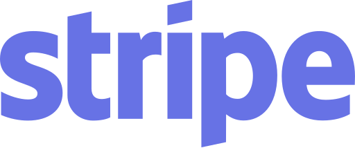

<h1 style="text-align: center;">
    Food delivery app for surfer🏄🏼‍♂️
</h1>

## Description

This app is designed for surfers who enjoy surfing at the beach all day long. We know that when there are good waves, we surfers don't want to leave the beach, but hunger strikes at some point. Sometimes, there are no restaurants nearby, or even if there are, they can be expensive, small in portion size, and not very tasty. Also, some rural areas may not have delivery services available. This app is designed to solve those problems. Of course, anyone can use this app, not just surfers. Additionally, if you're a restaurant owner, you can also sell your products through this app.

## Technologies Used

 
 
 
 
  

## Contributors

-   [Yuya Minamide](https://github.com/yuya-minamide)
    
